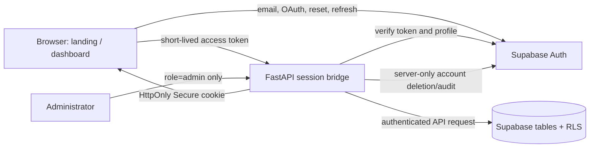

# TradeLogX SaaS authentication architecture

## Trust boundaries

- Supabase Auth owns passwords, password hashing, verification messages, OAuth
  exchanges, reset tokens, MFA, refresh-token rotation, and multi-device
  sessions. TradeLogX does not receive or store a password.
- The browser receives only the Supabase public URL and anon key. The backend
  verifies presented access tokens against `/auth/v1/user` and reads a
  RLS-protected `tradexa_profiles` record before authorizing a request.
- An authenticated browser receives a same-origin HttpOnly cookie containing a
  short-lived Supabase access token. The backend re-verifies it and caches a
  successful check for at most 30 seconds. No service key is ever exposed to
  browser JavaScript.
- `tradexa_profiles.role` is `user` or `admin`. A database trigger prevents a
  user from escalating their own role. Administrator API access is checked on
  the backend, not merely hidden in the UI.

## Data isolation

`supabase/migrations/0001_saas_auth.sql` adds `user_id` to every known
trading/user table that exists, adds cascading `auth.users` foreign keys,
indexes, enables and forces RLS, and gives access only to `auth.uid()` or an
administrator. Existing rows remain unassigned until the explicit legacy
backfill transaction assigns them to the first administrator.

The in-process legacy engine remains a single deployment-wide execution engine.
Until its stores have been fully switched to the RLS-backed Supabase tables,
only administrators may use deployment-wide engine controls. This deliberate
guard prevents a newly created customer session from reading or operating the
legacy owner’s paper account.

## Required deployment checks

Use the Supabase dashboard to configure email confirmation, redirect URLs,
SMTP and optional OAuth providers. Then follow
[DEPLOYMENT_VPS.md](DEPLOYMENT_VPS.md#supabase-customer-authentication-required-before-production-use).
