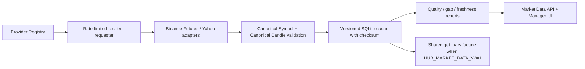

# Market Data Reliability Report

## Result

The Market Data Reliability Phase is implemented as an additive hardening of
the existing V2 cache. Legacy `/data/*` and `/market-data-v2/*` contracts remain
available; the new `/market-data/*` management API and dashboard page expose
provenance and health without changing strategy-facing symbol names.

## Weaknesses addressed

- Provider endpoints and wire symbols were embedded in the V2 service.
- Cache rows had no per-candle provenance or dataset checksum.
- Dataset quality did not expose freshness, a quality score, or checksum drift.
- Provider failures had no bounded retry/backoff/circuit behavior or metrics.
- Operators had no dedicated management UI for data quality and repair.

## Architecture

## Data model and rules

- `CanonicalSymbol` normalizes provider formats such as `BTCUSDT` to
  `BTC/USDT` and `EURUSD` to `EUR/USD`; adapters convert only at their boundary.
- `CanonicalCandle` requires UTC epoch milliseconds, a valid requested
  timeframe, non-negative OHLCV, `low <= open/close <= high`, a provider,
  provenance receipt time, market type, source quality, and a closed candle.
- Cached rows include provider, market type, closed status, received time, and
  quality. Dataset metadata records canonical symbol, schema version, provider,
  start/end coverage, update timestamps, SHA-256 checksum, dataset version and
  quality status.
- Missing continuous crypto ranges are returned exactly. Repair refetches only
  provider data; no interpolation or fabricated candles is possible.
- Checksum drift marks a cache unavailable. Staleness, gaps, corruption and
  checksum state drive a structured quality score/status.

## Provider architecture and observability

The registry currently contains the existing providers only:

| Provider | Markets | Authentication | Controls |
| --- | --- | --- | --- |
| Binance Futures | Crypto USDT perpetuals | None | 1,200 requests/min, retries, backoff/jitter, circuit breaker |
| Yahoo Finance | Stock/index/forex/commodity | None | 60 requests/min, retries, backoff/jitter, circuit breaker |

`GET /market-data/providers` exposes availability, last success, request/fail/
retry counts, and rolling latency. New management routes are `/providers`,
`/symbols`, `/status`, `/quality`, `/gaps`, `/download`, `/update`, `/repair`,
and `DELETE /cache/{symbol}/{timeframe}`. State-changing routes keep the
existing authentication policy.

## UI

The Dashboard now includes **Market Data** under System. It presents provider
health, canonical dataset identity/version, checksum status, freshness, exact
gaps, corruption state, quality score, and download/update/repair controls.

## Verification

- `64 passed` — reliability contracts/retries/checksum/API plus existing V2
  cache/broker, historical, fill, fee, and symbol tests.
- Dashboard production build passed.
- Diff whitespace validation passed.

## Known limitations and remaining risks

- Yahoo’s public intraday retention and exchange calendar coverage are limited;
  the service reports unavailable/incomplete data rather than inventing it.
- The current controlled fallback policy rejects venue/contract changes. No
  fallback provider is enabled for a cached range until compatible semantics
  and data licensing are configured.
- Checksum-invalid caches are immediately quarantined beside the cache file and
  marked `needs_download`; they are never served. Download/repair then rebuilds
  them from the recorded provider rather than repairing data locally.
- Full corporate-action adjustment, exchange holiday calendars and a licensed
  security master remain provider/data-entitlement decisions.

## Migration

Production `.env.example` sets `HUB_MARKET_DATA_V2=1`: all existing shared
`get_bars()` consumers (paper, replay, simulation, backtest, AI, journal and
analytics) use the same verified V2 cache or fail closed. Local development can
explicitly use `0` while comparing legacy behavior.
Pre-reliability V2 cache files without a checksum are deliberately treated as
unverified and quarantined; download them again through the manager first.
