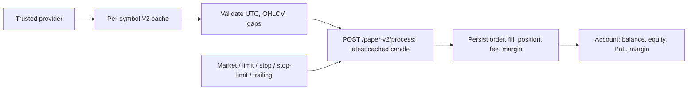

# Paper Trading Engine V2

Paper Trading V2 is an additive, strict broker-simulation path. Existing
`/paper/*` endpoints and the signal-driven `PaperExecutionEngine` are retained
unchanged for backward compatibility. New work uses `/paper-v2/*` and
`/market-data-v2/*`.

## Guarantees

- Candles come only from Binance USDT-perpetual REST (crypto) or Yahoo Finance
  (listed stocks, ETFs, indexes, forex and commodities). Cache or provider
  failure returns an error; V2 never generates, interpolates, or accepts a
  client-provided execution price.
- Caches are per asset and symbol at `HUB_MARKET_DATA_DIR`:
  `crypto/`, `stocks/`, `forex/`, and `commodities/`. Each SQLite file contains
  OHLCV, provider metadata, download/update timestamps, and missing ranges.
- Candle timestamps are stored in UTC. Primary keys prevent duplicates.
  Invalid OHLCV is rejected. Continuous crypto gaps are recorded and can be
  refetched; session-based markets are not falsely marked missing overnight.
- The broker persists orders, fills, positions, account balance, commissions,
  funding, and margin in `HUB_PAPER_BROKER_V2_DB`.

## Data lifecycle

1. Search/list symbols using `/market-data-v2/search` or `/market-data-v2/symbols`.
   Any normal US ticker can be looked up directly (the provider validates it at
   download time); use `asset_class=crypto-perpetual` to discover active
   Binance USDT perpetuals, with the required major-pair fallback offline.
2. Download a real history window with `POST /market-data-v2/download`.
   `period` defaults to `90d` and accepts `6mo`, `1y`, `2y`, `5y`, or `max`.
   It is converted server-side into a timeframe-aware count (90D at 1H is
   2,160 candles) and Binance pages requests beyond its 1,500-candle limit.
   `candles` remains an exact optional override.
3. Use `GET /market-data-v2/status/{symbol}` to see provider, cache freshness,
   timestamps, corruption count, and missing ranges.
4. Use `POST /market-data-v2/update` for idempotent incremental updates and
   `POST /market-data-v2/repair` to refetch missing crypto ranges.
   For multiple cached series use `POST /market-data-v2/update-batch`; it runs
   in the background and exposes progress at `GET /market-data-v2/update-batch/status`.

Supported V2 timeframes are `1m`, `3m`, `5m`, `15m`, `30m`, `1h`, `4h`, and
`1d`. Where Yahoo does not publish 3M or 4H directly, V2 aggregates complete,
adjacent 1M or 1H provider candles and omits incomplete groups; it never
interpolates a missing price. Provider retention can limit intraday history;
the API reports this honestly instead of creating extra candles.

## Broker flow

Create an order with `POST /paper-v2/orders` (`type`, `symbol`, `side`,
`quantity`, and any required limit/stop/trailing fields), then call
`POST /paper-v2/process/{symbol}`. The latter obtains its fill candle only from
the local V2 real-data cache. Market orders execute at the candle open plus
configured adverse spread/slippage. Limit, stop and stop-limit orders use
actual candle ranges; gap-through stops get the adverse opening price. Fill
size is constrained by candle volume participation. Reduce-only, invalid sizes,
closed markets, and insufficient margin are rejected.

`GET /paper-v2/account`, `/orders`, `/positions`, and `/fills` expose account
and audit state. `POST /paper-v2/positions/{symbol}/protection` adds stop loss,
take profit, or trailing protection. Funding is tracked by the broker's
`apply_funding()` only when a real provider funding rate is supplied.

## Compatibility and migration

V2 does not replace legacy simulation/replay/backtest paths in one release.
Those paths still accept their established inputs, including development-only
fallbacks. New production paper execution must use V2 endpoints and `HUB_DATA_DIR`
must point at the persistent Compose volume. Consumers should migrate to the
V2 cache in phases after their relevant historical provider coverage is loaded;
this avoids silently changing a strategy's historical series.

After validating the required cache coverage, set `HUB_MARKET_DATA_V2=1` and
restart. The shared `data.market_data.get_bars()` facade then routes existing
Paper, Replay, Simulation, Backtesting, AI Strategy Agent, Journal, and
Analytics consumers to this same strict cache. If a series was not downloaded,
they receive an unavailable result rather than any legacy synthetic fallback.

## Security and operations

All V2 state-changing routes require an operator or owner session, or a distinct
high-entropy `HUB_CONTROL_KEY`. `HUB_WEBHOOK_SECRET` is accepted only by the
TradingView ingestion route, and exchange access uses the separate
`HUB_EXCHANGE_API_KEY` / `HUB_EXCHANGE_API_SECRET` pair. Startup rejects reused
credentials. Do not commit `HUB_DATA_DIR` contents: it includes trading/account
data.
