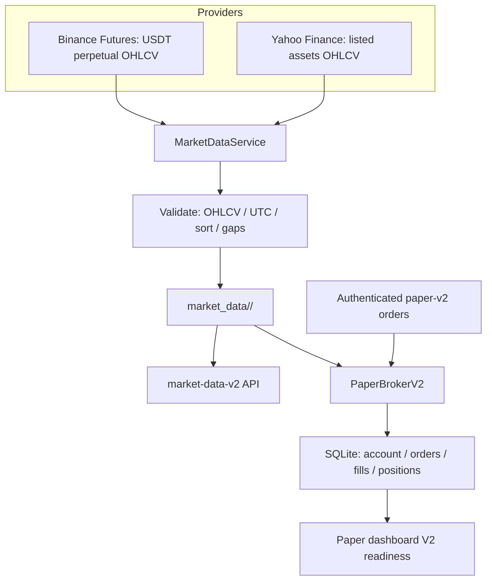

# Paper Trading Engine V2 Audit

## Scope and result

The existing production repository was reviewed without modifying the archived
`Tradexa-Trading-Bot` clone or its remote. Paper Trading V2 is implemented as
an additive path: legacy dashboard, Strategy Lab, AI, replay, backtesting,
journal, analytics, risk management, and `/paper/*` keep their existing
contracts.

## Existing capability

| Area | Existing state | V2 action |
| --- | --- | --- |
| Paper execution | Signal-price ledger engine; long/short/partial close | Retained; V2 adds explicit order lifecycle and persisted fills |
| Costs | Perfect or realistic fill model, fees, spread/slippage | V2 uses deterministic adverse spread/slippage, fees and volume participation |
| Crypto history | Binance spot SQLite cache, limited symbols/timeframes | V2 uses Binance USDT perpetual endpoint and requested 1m–1d timeframes |
| Other assets | Yahoo fetch facade, catalog/watchlists | V2 caches provider OHLCV per asset/symbol and fails closed |
| Data quality | Legacy integrity endpoint for its global cache | V2 rejects corrupt OHLCV, stores UTC, reports continuous crypto gaps |
| Persistence | Ledger/account/watchlist SQLite | V2 adds isolated broker/account/orders/fills SQLite state |

## Weaknesses found

1. The legacy `data.market_data.get_bars()` deliberately supports bundled and
   deterministic synthetic fallbacks for development. It is unsuitable as the
   execution source for a strict production simulator.
2. The legacy paper engine is signal-driven: an alert supplies entry/exit
   prices. It has no persistent open order book for market, limit, stop,
   stop-limit, or trailing orders.
3. Legacy Binance history targets spot pairs and has a fixed small symbol/timeframe
   matrix. Its single database does not keep per-symbol source metadata.
4. The catalog is a curated UI reference list, not a full static securities
   master. V2 accepts standard listed tickers through the Yahoo provider, while
   catalog search remains the discovery UX pending a licensed full securities
   master.
5. Provider retention and exchange calendar data are external constraints.
   V2 reports coverage/gaps instead of inventing candles. It does not claim a
   5-year 1-minute series where the provider cannot serve one.

## V2 architecture



### Persistent schema

`market_data/<asset>/<symbol>.sqlite3`

- `candles(timeframe, open_time, open, high, low, close, volume)` — composite
  primary key prevents duplicates.
- `metadata(key, value)` — provider, asset class, schema version, download and
  update timestamps, and missing ranges.

`paper_broker_v2.db`

- `v2_account` — starting balance, realized balance, fees, funding.
- `v2_positions` — net side/size/entry and optional SL/TP/trailing state.
- `v2_orders` — order parameters, execution state, fill progress/rejection.
- `v2_fills` — immutable fill audit rows including price, fee, realized PnL.

## Execution model

- Market orders fill from the next processed real candle open.
- Limit orders must cross the real candle range; the model permits only the
  open or the resting limit, whichever is conservative for the trader.
- Stops fill at a gap-through opening price when adverse; stop-limit orders
  remain resting after trigger until the limit is tradeable.
- Fill quantity is capped by `candle.volume * participation_rate` so a single
  OHLCV bar cannot supply unlimited liquidity.
- Every fill applies adverse half-spread, slippage, commission and a margin
  check. Reduce-only with no opposing position, invalid quantities, unavailable
  cached data, closed catalog markets, and insufficient margin are rejected.
- SL, TP, and trailing protection use the same processed candle. Funding is
  booked only with a supplied real funding rate; none is fabricated.

## API summary

Read-only: `GET /market-data-v2/symbols`, `/search`, `/status/{symbol}`,
`/metadata/{symbol}`, `/latest/{symbol}`, `/paper-v2/account`, `/orders`,
`/positions`, `/fills`.

Authenticated (`X-Webhook-Secret` under the current authorization policy):
`POST /market-data-v2/download`, `/update`, `/update-batch`, `/repair`, `/paper-v2/orders`,
`/paper-v2/orders/{id}/cancel`, `/paper-v2/positions/{symbol}/protection`, and
`/paper-v2/process/{symbol}`.

## Verification

| Check | Result |
| --- | --- |
| Cache metadata / dedupe / integrity / strict unavailable error | PASS |
| Market, limit, stop, reduce-only, protective stop execution | PASS |
| Margin rejection and adverse gap-through stop handling | PASS |
| Broker SQLite restart persistence | PASS |
| Authenticated V2 API processing from cached candle | PASS |
| Live Binance Futures BTCUSDT 1H download and cache validation | PASS (2 real candles) |
| Pagination beyond Binance's 1,500-candle API page | PASS |
| Background V2 update progress job | PASS |
| Existing historical, fill, fee, and symbol-universe focused suites | PASS |
| Optional shared-facade migration to strict V2 cache | PASS |
| Dashboard production TypeScript build | PASS |
| Docker runtime verification | Not run in this macOS environment; use repository Compose validation on VPS |

Focused command executed:

```sh
PYTHONPATH=automation-hub /private/tmp/tradexa-v2-venv/bin/python -m pytest \
  automation-hub/tests/test_market_data_v2.py \
  automation-hub/tests/test_paper_broker_v2.py \
  automation-hub/tests/test_historical.py \
  automation-hub/tests/test_fill_model.py \
  automation-hub/tests/test_paper_fees.py \
  automation-hub/tests/test_symbol_universe.py -q
# 57 passed
```

## Phased integration plan

1. **Implemented now:** strict cache, provider download/update/repair, broker
   lifecycle, persistence, secured API, dashboard readiness, and tests. The
   `HUB_MARKET_DATA_V2=1` switch moves every existing shared-facade consumer to
   the V2 cache without rewriting their public contracts.
2. **Next controlled phase:** compare replay, simulation, backtesting, AI and
   analytics outputs with the switch off/on for each pre-downloaded market
   before making strict V2 cache mode the production default.
3. **Before live capital:** use a licensed market-data/securities-master
   provider for corporate actions, exchange calendars, full S&P/NASDAQ/NYSE
   enumeration, and historical funding/contract specifications. This is a
   production data entitlement decision, not a code fallback.
